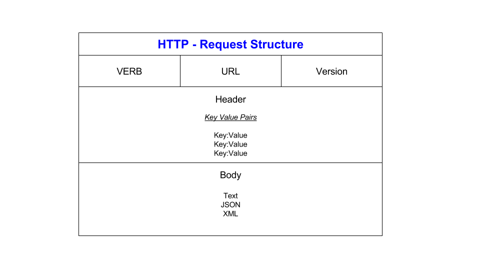

## What are API’s?

API stands for Application Programming Interface. It is a set of rules and protocols that allows one software application to interact with another. APIs enable different software systems to communicate and share data.

## How are they used and why are they so popular?

APIs are used to enable the integration of different software applications or services. They allow developers to access the functionalities of a system or service without needing to understand its internal workings.

### Some of the reasons why APIs are popular are:

- Potential to increase revenue for the business
- Enhances customer reach and value
- Enhances sales & marketing activities

## What is REST API

A REST API  is an application programming interface (API or web API) that conforms to the constraints of REST architectural style

RESTful simply means a service provides a REST interface that a developer can communicate with.

- **Stateless**: Each request from a client to a server must contain all the information needed to understand and fulfill the request. The server should not rely on any prior requests.
- **Client-Server**: The client and server should be separate entities that can evolve independently. They communicate over a stateless protocol (e.g., HTTP).
- **Uniform Interface**: The interface should be consistent and should not change between requests. It includes a resource identifier, a representation of the resource, and links to related resources.
- **Layered System**: The architecture should be composed of multiple layers, with each layer responsible for a specific aspect

## What is HTTP & HTTPS?

HTTP stands for Hypertext Transfer Protocol. It's a set of rules that defines how information is exchanged on the World Wide Web. In simpler terms, it's the language that web browsers and servers use to communicate with each other.

HTTPS stands for Hypertext Transfer Protocol Secure. It's just like HTTP, but with an added layer of encryption. This encryption ensures that the data exchanged between your browser and the server is secure and cannot be easily intercepted by malicious actors.

## HTTP Request


**VERB:** 
This tells the server what action the client wants to perform. The most common methods are:
- GET: Retrieve data from the server (like loading a webpage).
- POST: Send data to the server (like submitting a form).
- PUT: Update data on the server.
- DELETE: Remove data from the server.

**URL**: This is the address of the resource the client is requesting. It tells the server exactly where to find the resource on the web.

**VERSION**: This specifies the version of the HTTP protocol being used (e.g., HTTP/1.1 or HTTP/2.0). It helps the server understand how to process the request.

**HEADERS**: Headers provide additional information about the request. They are in the form of key-value pairs.

**BODY** : This part of the request is used for sending data to the server. It's common in POST or PUT requests, where you're submitting form data

## HTTP Response


**RESPONSE CODE:** A status code, which is a three-digit number indicating the outcome of the request (e.g., 200 for success, 404 for not found).

**VERSION:** The HTTP version being used.

**HEADER:** Like in an HTTP request, headers provide additional information about the response. They are in the form of key-value pairs 

Some common headers include:
- Content-Type: Specifies the type of data being sent in the response (e.g., HTML, JSON, XML).
- Content-Length: Indicates the size of the response content in bytes.
- Date: Shows the date and time when the response was generated.

**BODY:** 
This is the actual content of the response. It could be HTML for a webpage, JSON for data, an image, or any other type of data. The presence of a body depends on the type of request and what the server needs to send back.

Example of an HTTP Response:
```php
HTTP/1.1 200 OK
Content-Type: text/html; charset=UTF-8
Content-Length: 16384
Date: Wed, 28 Sep 2023 14:00:00 GMT

<!DOCTYPE html>
<html>
<head>
    <title>Example Page</title>
</head>
<body>
    <h1>Hello, World!</h1>
</body>
</html>


```


