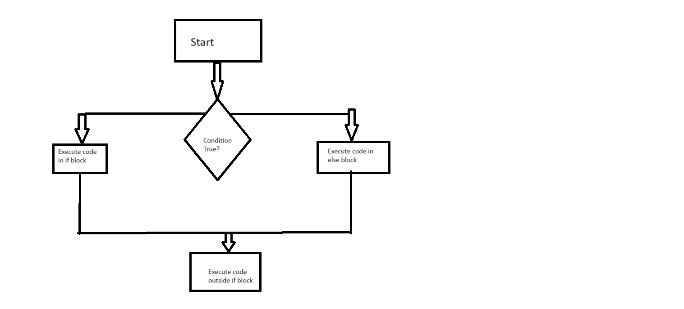
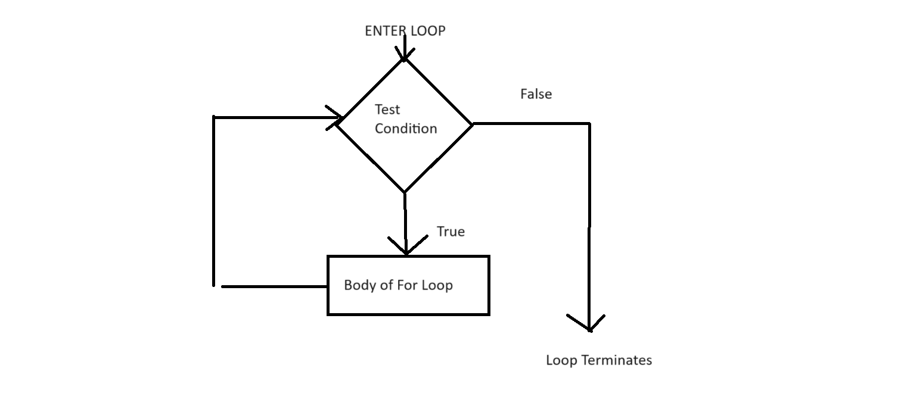

# Control Flow in Python

Control flow refers to the order in which the statements of a program are executed. It allows us to make decisions, execute loops, and define the order of execution in a program.

## Conditional Statements (if-elif-else)

Conditional statements allow you to execute different code based on different conditions.

### `if` Statement

```python
if condition:
    # Code to execute if the condition is True
```


### `elif` Statement
```python
if condition1:
    # Code to execute if condition1 is True
elif condition2:
    # Code to execute if condition2 is True and condition1 is False
```

### `else` Statement
```python
if condition:
    # Code to execute if the condition is True
else:
    # Code to execute if the condition is False
```

#### Example:
```python
x = 10

if x > 5:
    print("x is greater than 5")
elif x == 5:
    print("x is equal to 5")
else:
    print("x is less than 5")
```
Output:
```
x is greater than 5
```


# For Loops in Python

A `for` loop is a control flow statement that iterates over iterable objects. It executes a block of code for each element in the sequence.

## Basic Syntax

```python
for item in iterable:
    # Code to be executed for each item
```
item: Represents the current element in the iteration. <br>
iterable: Refers to the collection of items to iterate over.

Lets create some a list, an embedded list and a dictionary to loop over:

```python
list_data=[1,2,3,4,5]
embedded_list = [[1,2,3],[4,5,6]]
dict_data = {
    1: {"name":"Bronson",
        "money":"£0.05"},
    2: {"name":"Masha",
        "money":"£3.66"},
    3: {"name":"Roscoe",
        "money":"£1.14"}
}

```
#### Iterating over a list:
```python
print(dict_data)

for num in list_data:
    print(num * 2)

```
Output:
```
2
4
6
8
10
```
#### Nested For Loops

```python
for data in embedded_list:
    print(data)
    for num in data:
        print(num)
```

Output:
```
[1, 2, 3]
1
2
3
[4, 5, 6]
4
5
6
```
#### Looping through dictionaries

```python
for item in dict_data.values():
    for embed in item.values():
        print(embed)
```
Output:
```
Bronson
£0.05
Masha
£3.66
Roscoe
£1.14

```
```python
for items in dict_data.values():
    print(items["money"])
```
Output:
```
£0.05
£3.66
£1.14
```

#### Loops and if statements
Using the collections above lets create a loop with some if statements:
```python
for num in list_data:
    if num == 3:
        print("I found 3")
    elif num > 3:
        print("Gone too far!")
    else:
        print("Too Soon!")
```
Output:
```
Too Soon!
Too Soon!
I found 3
Gone too far!
Gone too far!
```