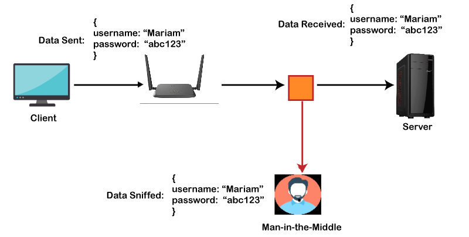

# Understanding SSH

## What is SSH?

SSH, short for Secure Shell or Secure Socket Shell, is a network protocol designed to provide a secure means for users, especially system administrators, to remotely access a computer over a network that may not be inherently secure

## What is SSH used for?
SSH is a way to securely connect to another computer over the internet. It's like having a secret tunnel that lets you control and interact with a computer from a distance, even if that computer is far away. This is useful for things like managing servers or transferring files between computers, whilst making sure that your communication remains private and protected

SSH uses a pair of cryptographic keys: a **private key** and a **public key**

- **Private Key:** This is kept secret and should never be shared, it is used to decrypt data that was encrypted with the corresponding public key

- **Public Key:** This key is meant to be shared freely, it's used by anyone who wants to send you data securely, when someone encrypts data with your public key, only your private key can decrypt it

## Why use SSH & How does it increase security?

SSH significantly increases security by encrypting the connection between a client and a server  
This encryption prevents eavesdropping and man-in-the-middle attacks where an attacker intercepts and potentially alters the data being transmitted

